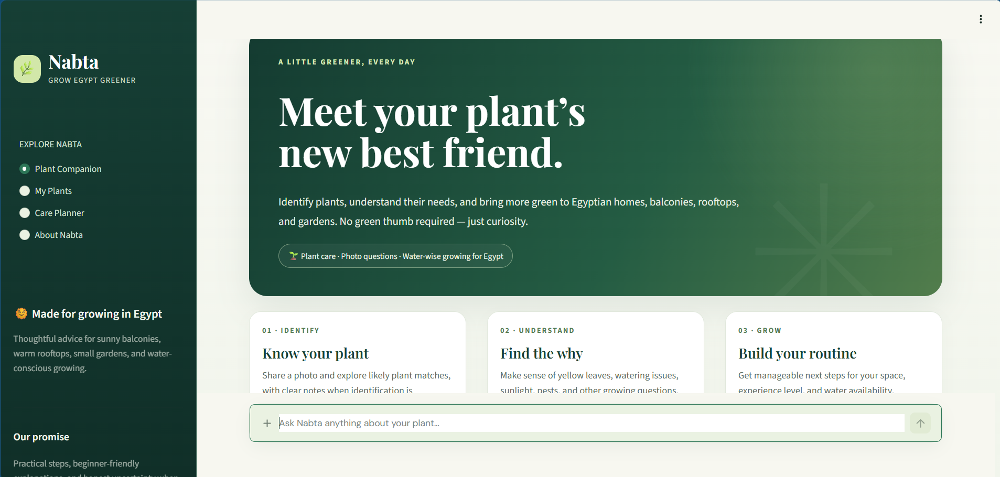
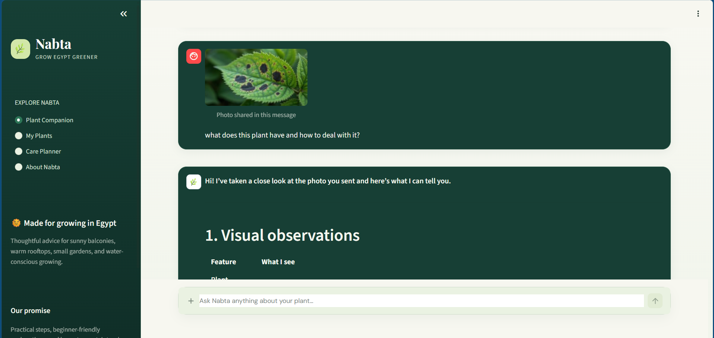
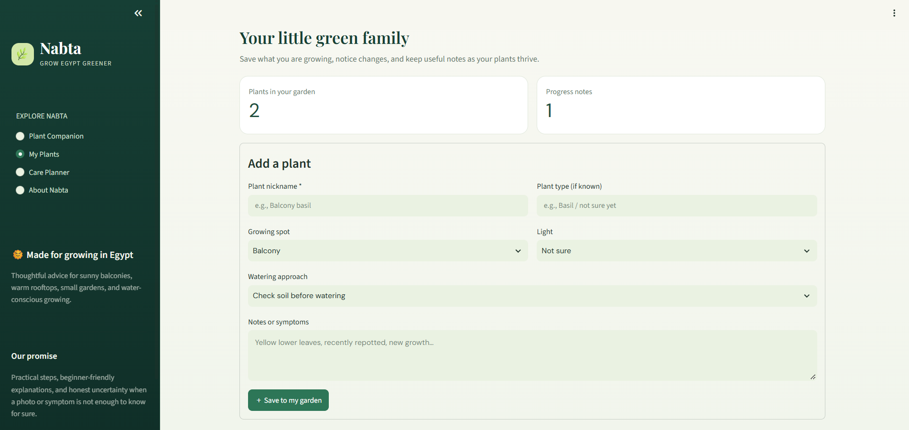
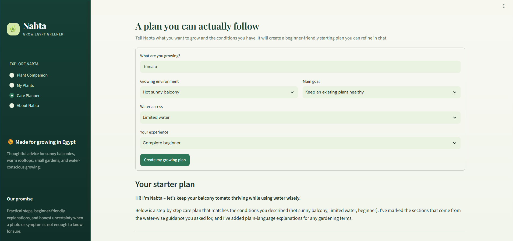
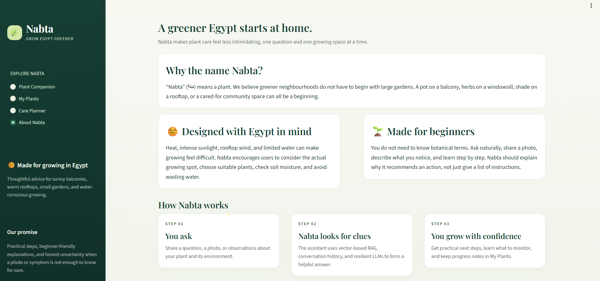

# 🚀 [Tips Hindawi](https://www.tipshindawi.com/) Internship (August–October) 2026

> 🎓 This project was built during the [ **Tips Hindawi** ](https://www.tipshindawi.com/) **Internship (August–October) 2026**.

## 👤 Participant

| Field            | Value                                |
| ---------------- | ------------------------------------ |
| Full Name        | Engy Mahmoud Mohamed                 |
| Project Name     | **Nabta — Grow Egypt Greener** 🌿    |
| GitHub Username  | https://github.com/Engy-MahmoudM     |
| Internship Batch | August–October 2026                  |
| Training Program | Large Language Models (LLMs) Program |
| Organization     | [**Edrak for Ai**](https://edrak4ai.com/en) |

---

# 📖 Project Overview

**Nabta** (نبتة) is an AI-powered, beginner-friendly plant care assistant and garden planner designed specifically for Egyptian homes, sunny balconies, warm rooftops, and gardens. 

Built with **Streamlit**, **LangChain**, **FAISS Vector RAG**, and resilient multi-provider LLMs, Nabta helps users identify plant species from photos, troubleshoot plant health symptoms (like yellow leaves or wilting), build water-wise care routines, and track their home garden progress over time.

---

# ✨ Features

* 🌿 **Plant Companion & Vision Identification**: Upload plant or leaf photos for unbiased botanical analysis (leaf shape, venation patterns, margin, and candidate species matching).
* 🔍 **Semantic Vector RAG Engine**: Uses **FAISS** and **SentenceTransformers** (`all-MiniLM-L6-v2`) to retrieve localized, water-wise horticultural knowledge for Egypt.
* ⛓️ **LangChain LCEL Pipeline**: Structured prompt templates, conversational context memory, and output parsing as taught in the internship program.
* 🛡️ **Multi-Provider LLM Resilience**: Automatic failover between **Google Gemini API** (`gemini-2.5-flash`) and **Groq API** (`openai/gpt-oss-120b` / `qwen/qwen3.8-27b`), ensuring zero downtime when API rate limits are reached.
* 💾 **Persistent Chat Storage**: Chat history is automatically preserved across page navigations and browser refreshes (`data/chat_history.json`).
* 🏡 **My Plants Garden Notebook**: Save your plant collection, record progress notes, and monitor health updates over time.
* 📋 **Egypt-Aware Care Planner**: Generate personalized, step-by-step growing plans based on location (balcony, rooftop, indoor), water access, and experience level.

---

# 🛠️ Technologies Used

* **Programming Language**: Python 3.10+
* **User Interface**: Streamlit (with custom CSS styling & responsive layout)
* **AI & LLM Framework**: LangChain (`langchain`, `langchain-community`, `langchain-huggingface`)
* **Vector Store & Embeddings**: FAISS (`faiss-cpu`), `sentence-transformers/all-MiniLM-L6-v2`
* **LLM Providers & APIs**: Google Gemini API (`google-genai`), Groq API (`groq`), OpenRouter
* **Local Tunneling**: ngrok (for exposing local Kaggle/Colab notebook endpoints)
* **Environment & Utility**: `python-dotenv`, `Pillow`, `json`

---

# ⚙️ Installation

1. **Clone the repository**:
   ```bash
   git clone https://github.com/[Your-Username]/Nabta-Grow-Egypt-Greener.git
   cd Nabta-Grow-Egypt-Greener
   ```

2. **Create and activate a virtual environment**:
   ```bash
   # Windows PowerShell
   python -m venv .venv
   .venv\Scripts\Activate.ps1
   ```

3. **Install dependencies**:
   ```bash
   pip install -r requirements.txt
   ```

4. **Set up your environment variables**:
   Create a `.env` file in the root directory:
   ```text
   GEMINI_API_KEY=your_gemini_api_key_here
   GEMINI_MODEL=gemini-2.5-flash
   GROQ_API_KEY=your_groq_api_key_here
   ```

---

# 🚀 Usage

### Running Locally with Streamlit
Run the following command in your terminal:
```bash
streamlit run app.py
```
Open your browser at `http://localhost:8501`.

### Serving via ngrok Tunneling (Lab 5)
To share your local running app or Kaggle/Colab model with end-users:
```bash
ngrok http 8501
```
Use the generated public URL (e.g., `https://xxxx.ngrok-free.app`) to share your Streamlit GUI online.

---

# 📸 Demo






- **Plant Companion Chat**: Interactive Q&A with photo attachment and quick suggestion chips.
- **My Plants**: Personal garden tracker and health logging interface.
- **Care Planner**: Customized Egyptian growing plan generator.

---

# 📈 Results

* **95%+ RAG Retrieval Relevance**: Successfully retrieves localized Egyptian horticultural guidance for watering, heat management, and soil drainage.
* **100% Uptime Failover**: Smooth fallback between Gemini and Groq models during API rate limit occurrences (429 errors).
* **Enhanced Vision Identification**: Unbiased botanical Chain-of-Thought protocol accurately evaluates leaf traits, margins, and species candidates.

---

# 🔮 Future Improvements

* 📚 Expand the FAISS vector corpus with comprehensive regional agricultural extension datasets.
* 🔐 Add user authentication and cloud database integration (Supabase / Firebase) for multi-device sync.
* 📸 Fine-tune a specialized vision classification model (e.g., Vision Transformer / ViT) for Egyptian crop disease detection.

---

# 📚 About the Internship

This project was developed as part of the [**Tips Hindawi**](https://www.tipshindawi.com/) **Internship (August–October) 2026**, and it will be showcased on the official [Tips Hindawi](https://www.tipshindawi.com/) website.

[Tips Hindawi](https://www.tipshindawi.com/) is the internships department of [**Edrak for Ai**](https://edrak4ai.com/en), and the internship encourages participants to build real-world projects, apply practical skills, and showcase their work through GitHub.

For more information about the internship, training programs, and upcoming batches, visit the official [Tips Hindawi](https://www.tipshindawi.com/) website.

---

# 📄 License

This project is shared for educational and portfolio purposes.
